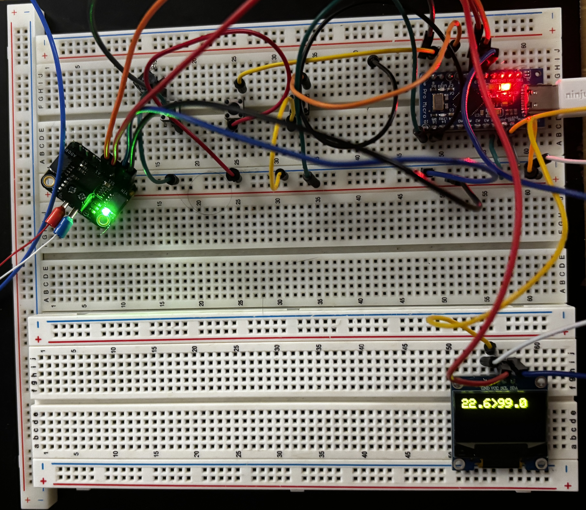

# GaggiaPID
Arduino-based PID control system for my espresso machine.

Forked and took inspiration from https://github.com/samrausch/gaggiaPID/.


*More update and build pictures are stored in the `assets/` directory.*

### End Goal
Finely control the boiler temperature of my boiler with the PID algorithm, and create a user interface to easily change parameters / target temperature.

### Components
* Arduino board of your choice (I am using an *offbrand* [Sparkfun Pro Micro](https://www.sparkfun.com/pro-micro-5v-16mhz.html))
* MCP9600 thermocouple amp (https://www.adafruit.com/product/4101)
* M4 threaded K-type thermocouple (widely available from Amazon, etc as a replacement part for 3D printers)
* 128x64 I2C OLED screen (substitute any screen you prefer but you'll need to update the code for your specific unit)
* 4 buttons (I used these: https://www.aliexpress.com/item/32811149954.html?spm=a2g0s.9042311.0.0.49554c4dRzoluB)
* Solid state relay (I used this: https://www.amazon.com/gp/product/B07Y33RZ8F/ref=ppx_yo_dt_b_search_asin_title?ie=UTF8&psc=1)
* Braided cable sleeve (optional), I used https://www.amazon.com/gp/product/B07QJW9FKS/ref=ppx_yo_dt_b_search_asin_title?ie=UTF8&psc=1

## Code Structure

### File Layout
```
src/
├── buttonHandler.cpp
├── buttonHandler.h
├── display.cpp
├── display.h
├── eepromHandler.cpp
├── eepromHandler.h
├── gaggiaPID.cpp
├── gaggiaPID.h
├── main.cpp
├── PIDController.cpp
├── PIDController.h
├── SSR.cpp
├── SSR.h
├── thermocouple.cpp
└── thermocouple.h
```

### Class Layout

- **GaggiaPID**  
  Main application class. Coordinates all subsystems, handles User Interaction, and lays out the system's state machine.

- **ButtonHandler**  
  Handles input from physical buttons, debouncing, and button state tracking.

- **Display**  
  Manages the OLED display.

- **PIDController**  
  Implements the PID control algorithm for temperature regulation.

- **SSR**  
  Controls the solid-state relay for switching the boiler heater on and off using time-proportional control.

- **Thermocouple**  
  Interfaces with the MCP9600 thermocouple amplifier to read temperature data.

- **EEPROMHandler**  
  Reads and writes persistent settings (temperatures, PID parameters) to EEPROM. Reads these values on start up.

## How to Build
- Now using [PlatformIO](https://platformio.org/) instead of ArduinoIDE, to allow development in VSCode

1. Clone in VSCode
2. Follow suggestion To install PlatformIO plugin and follow installation steps
3. To Verify / Upload your code on to your arduino, just press the shortcut buttons on the bottom tool bar (PlatformIO must be loaded)